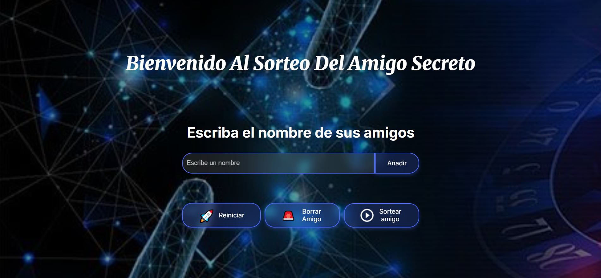
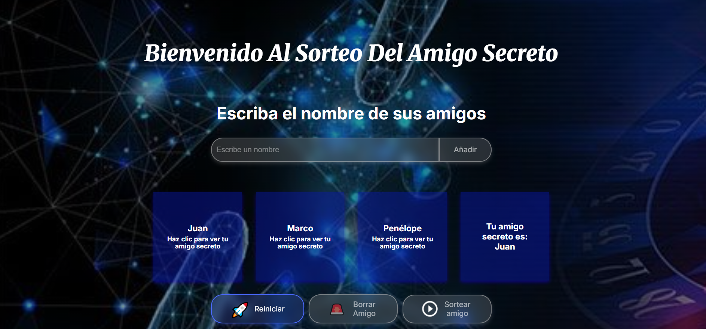
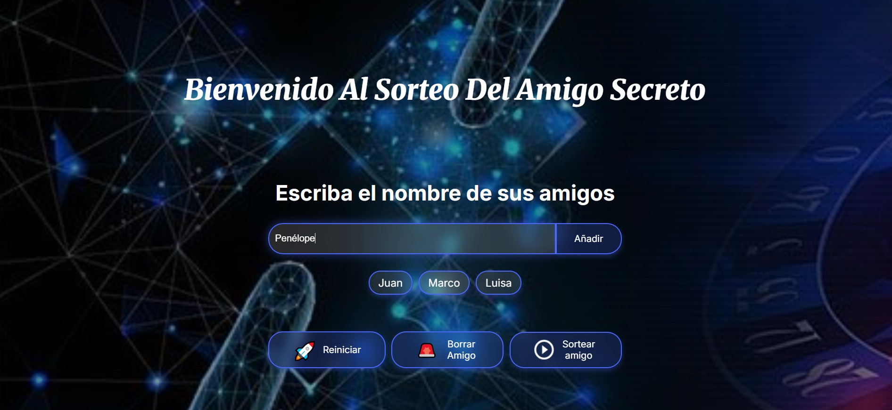

# 🎁 Amigo Secreto / Secret Santa

[](https://github.com/Yaaxek/Sorteo-De-Amigo)
[](https://developer.mozilla.org/en-US/docs/Web/HTML)
[](https://developer.mozilla.org/en-US/docs/Web/CSS)
[](https://developer.mozilla.org/en-US/docs/Web/JavaScript)

---

## 🇪🇸 Español

### 🎯 Descripción
**Amigo Secreto** es una aplicación web moderna y elegante que facilita la organización del tradicional juego del amigo secreto. Con una interfaz intuitiva y un diseño atractivo, permite agregar participantes, realizar sorteos automáticos y revelar los resultados de manera interactiva.

### ✨ Características Principales
- 🎨 **Diseño Moderno**: Interfaz elegante con efectos de transparencia y blur
- 📱 **Responsive**: Se adapta perfectamente a cualquier dispositivo
- 🎲 **Sorteo Automático**: Algoritmo Fisher-Yates para un sorteo justo
- 🎭 **Revelación Interactiva**: Haz clic en las tarjetas para revelar tu amigo secreto
- 🔄 **Gestión Completa**: Agregar, eliminar y reiniciar participantes
- 🌙 **Tema Oscuro**: Diseño moderno con fondo oscuro y efectos de luz

### 🚀 Tecnologías Utilizadas
- **HTML5**: Estructura semántica y accesible
- **CSS3**: Variables CSS, Flexbox, efectos de transparencia y animaciones
- **JavaScript**: Lógica de sorteo, manipulación del DOM y interactividad
- **Google Fonts**: Tipografías Inter y Merriweather

### 🎮 Cómo Usar
1. **Agregar Participantes**: Escribe el nombre y haz clic en "Añadir"
2. **Gestionar Lista**: Usa "Borrar Amigo" para eliminar el último o "Reiniciar" para empezar de nuevo
3. **Realizar Sorteo**: Haz clic en "Sortear amigo" cuando tengas al menos 2 participantes
4. **Revelar Resultados**: Haz clic en cada tarjeta para ver tu amigo secreto
5. **Disfrutar**: ¡El resultado se oculta automáticamente después de 2 segundos!

### 🎨 Características del Diseño
- **Paleta de Colores**: Azul moderno con transparencias elegantes
- **Efectos Visuales**: Sombras, blur, hover effects y transiciones suaves
- **Tipografía**: Combinación de Inter (sans-serif) y Merriweather (serif)
- **Interactividad**: Botones con estados hover y disabled
- **Accesibilidad**: Etiquetas ARIA y navegación por teclado

---

## 🇺🇸 English

### 🎯 Description
**Secret Santa** is a modern and elegant web application that facilitates the organization of the traditional Secret Santa game. With an intuitive interface and attractive design, it allows adding participants, performing automatic draws, and revealing results interactively.

### ✨ Main Features
- 🎨 **Modern Design**: Elegant interface with transparency and blur effects
- 📱 **Responsive**: Perfectly adapts to any device
- 🎲 **Automatic Draw**: Fisher-Yates algorithm for fair drawing
- 🎭 **Interactive Revelation**: Click on cards to reveal your secret friend
- 🔄 **Complete Management**: Add, remove, and reset participants
- 🌙 **Dark Theme**: Modern design with dark background and light effects

### 🚀 Technologies Used
- **HTML5**: Semantic and accessible structure
- **CSS3**: CSS variables, Flexbox, transparency effects and animations
- **JavaScript**: Drawing logic, DOM manipulation and interactivity
- **Google Fonts**: Inter and Merriweather typographies

### 🎮 How to Use
1. **Add Participants**: Type the name and click "Add"
2. **Manage List**: Use "Delete Friend" to remove the last one or "Reset" to start over
3. **Perform Draw**: Click "Draw friend" when you have at least 2 participants
4. **Reveal Results**: Click on each card to see your secret friend
5. **Enjoy**: The result automatically hides after 2 seconds!

### 🎨 Design Features
- **Color Palette**: Modern blue with elegant transparencies
- **Visual Effects**: Shadows, blur, hover effects and smooth transitions
- **Typography**: Combination of Inter (sans-serif) and Merriweather (serif)
- **Interactivity**: Buttons with hover and disabled states
- **Accessibility**: ARIA labels and keyboard navigation

---

## 🛠️ Instalación / Installation

### 🇪🇸 Español
```bash
# Clonar el repositorio
git clone https://github.com/Yaaxek/Sorteo-De-Amigo.git

# Navegar al directorio
cd Sorteo-De-Amigo

# Abrir en el navegador
# Simplemente abre index.html en tu navegador favorito
```

### 🇺🇸 English
```bash
# Clone the repository
git clone https://github.com/Yaaxek/Sorteo-De-Amigo.git

# Navigate to directory
cd Sorteo-De-Amigo

# Open in browser
# Simply open index.html in your favorite browser
```

---

## 📸 Capturas de Pantalla / Screenshots

### Interfaz Principal / Main Interface


### Sorteo Realizado / Draw Completed


### Cómo Agregar Nombres / How to Add Names


---

## 🤝 Contribuir / Contributing

### 🇪🇸 Español
¡Las contribuciones son bienvenidas! Si tienes ideas para mejorar la aplicación:

1. Haz un Fork del proyecto
2. Crea una rama para tu feature (`git checkout -b feature/AmazingFeature`)
3. Commit tus cambios (`git commit -m 'Add some AmazingFeature'`)
4. Push a la rama (`git push origin feature/AmazingFeature`)
5. Abre un Pull Request

### 🇺🇸 English
Contributions are welcome! If you have ideas to improve the application:

1. Fork the project
2. Create a feature branch (`git checkout -b feature/AmazingFeature`)
3. Commit your changes (`git commit -m 'Add some AmazingFeature'`)
4. Push to the branch (`git push origin feature/AmazingFeature`)
5. Open a Pull Request

---

## 👨‍💻 Autor / Author

**Yaaxek**
- GitHub: [@Yaaxek](https://github.com/Yaaxek)

---

## 🙏 Agradecimientos / Acknowledgments

- **Alura**: Por el desafío que inspiró este proyecto
- **Google Fonts**: Por las hermosas tipografías
- **Comunidad de desarrolladores**: Por el apoyo y feedback

---

<div align="center">

### ⭐ ¡Dale una estrella si te gustó el proyecto! / Give it a star if you liked the project!

[](https://github.com/Yaaxek/Sorteo-De-Amigo/stargazers)

</div>
